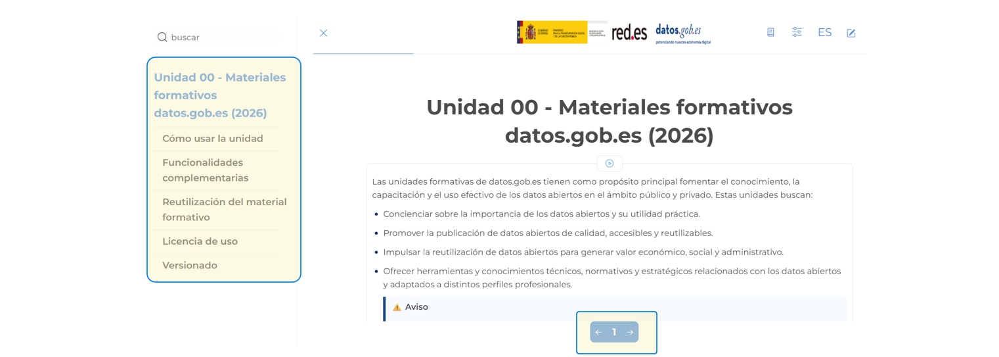
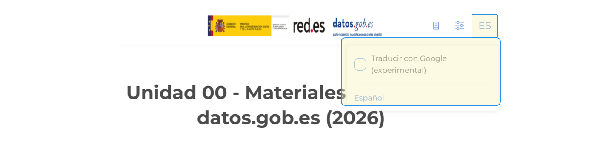
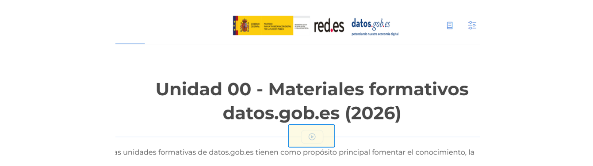

<!--
module_id: unidad-formativa-00
author: Equipo gestor de la plataforma datos.gob.es
email: contacto@datos.gob.es
date: 26/01/2026
version: 0.1.0.0
language: es
narrator: Spanish Female
mode: Textbook
title: Unidad 00 - Materiales formativos datos.gob.es (2026)
comment: Esta unidad presenta la guía de uso y el alcance general de los materiales formativos de datos.gob.es (Iniciativa Aporta).
long_description: Unidades didácticas. Unidad 00 - Materiales formativos datos.gob.es (2026). Guía de uso y alcance general. Más información en [datos.gob.es](https://datos.gob.es/)

edit: true

repository: https://github.com/datosgobes/unidad-formativa-00

logo:     https://cdn.jsdelivr.net/gh/datosgobes/materiales-formativos@main/assets/img/logo_dge_square.svg

icon:     https://cdn.jsdelivr.net/gh/datosgobes/materiales-formativos@main/assets/img/logo_conjunto.png

dark:   false

script: https://cdn.jsdelivr.net/chartist.js/latest/chartist.min.js

link: https://fonts.googleapis.com/css2?family=Montserrat:ital,wght@0,100..900;1,100..900&display=swap
      https://raw.githack.com/datosgobes/materiales-formativos/refs/heads/main/assets/css/dge-styles.css

font: Montserrat

attribute: Iniciativa de datos abiertos del Gobierno de España [CC BY 4.0](https://creativecommons.org/licenses/by/4.0/)
-->

# Unidad 00 - Materiales formativos datos.gob.es (2026)

{{|>}}
*************************************************************************************************************

Las unidades formativas de datos.gob.es tienen como propósito principal fomentar el conocimiento, la capacitación y el uso efectivo de los datos abiertos en el ámbito público y privado. Estas unidades buscan:

-	Concienciar sobre la importancia de los datos abiertos y su utilidad práctica.
-	Promover la publicación de datos abiertos de calidad, accesibles y reutilizables.
-	Impulsar la reutilización de datos abiertos para generar valor económico, social y administrativo.
-	Ofrecer herramientas y conocimientos técnicos, normativos y estratégicos relacionados con los datos abiertos y adaptados a distintos perfiles profesionales.

Nuestro objetivo es que podáis avanzar paso a paso, consolidando conocimientos mientras seguimos construyendo esta experiencia formativa.

	Unidades formativas disponibles

Con esta Unidad 00 se comienza la nueva serie de unidades formativas de datos.gob.es.

Actualmente están disponibles las unidades siguientes:

 -  <a href="https://github.com/datosgobes/materiales-formativos" target="_blank" rel="noopener">Unidad 01 - Datos abiertos: conceptos básicos y beneficios</a>

Poco a poco iremos liberando el resto de los contenidos de forma progresiva.

*************************************************************************************************************

## Cómo usar la unidad

{{|>}}
*************************************************************************************************************

**Navegación**

Puedes navegar el curso a través del índice de la parte izquierda o usando las flechas de navegación del teclado o de la parte inferior de la web.

**Recursos disponibles**

Para facilitar un aprendizaje bien contextualizado y práctico, cada unidad formativa incorpora diversos recursos diseñados para profundizar en los conceptos, ilustrarlos con ejemplos, ampliar información y afianzar el conocimiento a través de la práctica. 

A continuación, se presentan los tipos de recursos que encontrarás en cada unidad:

- 📖 **Fuente**: origen de la definición o de la información que respalda el concepto o información que se está presentando.
- 💡**Ejemplo**: casos concretos que facilitan la comprensión.
- ⚠️ **Aviso**: consejo o dato práctico para entender lo presentado.
- ℹ️ **Más información**: material de relevancia que complementa lo explicado.
- 🧪 **Caso de estudio**: casos reales para afianzar conocimientos.
- ✏️ **Ejercicio**: actividades para aplicar los conocimientos adquiridos.

**Evaluación**

Al finalizar cada sección, tendrás la oportunidad de responder preguntas para comprobar tu aprendizaje. 

	

		⚠️ Aviso
	

	

Estas actividades solo están disponibles en la versión LiaScript.
  

*************************************************************************************************************

## Funcionalidades complementarias

{{|>}}
*************************************************************************************************************

**Traducción**

Existe la posibilidad de visualizar el curso en otros idiomas con un solo clic, seleccionando, en los enlaces de la parte superior derecha, el texto de la abreviatura del idioma actual y eligiendo el idioma de traducción.

	

		⚠️ Aviso
	

	

Ten presente que la traducción automática puede contener errores o interpretaciones incorrectas de algunos conceptos.
  

**Narración**

El curso incorpora secciones con narración en audio. Puedes activar o desactivar esta función desde el botón ubicado en la parte superior de cada página.

*************************************************************************************************************

## Reutilización del material formativo

{{|>}}
*************************************************************************************************************

Para reutilizar el material de las unidades formativas, accede al código que está publicado en <a href="https://github.com/datosgobes/materiales-formativos" target="_blank" rel="noopener">este enlace</a>.

Este curso está diseñado en <a href="https://liascript.github.io/" target="_blank" rel="noopener">LiaScript</a>. 
Para conocer más sobre las especificaciones técnicas y funcionales utilizadas por LiaScript, consulta la <a href="https://liascript.github.io/course/?https://raw.githubusercontent.com/liaScript/docs/master/README.md" target="_blank" rel="noopener">documentación oficial</a>.

*************************************************************************************************************

## Licencia de uso 

{{|>}}
*************************************************************************************************************

Este material se publica bajo la licencia **Creative Commons Attribution 4.0 International (CC BY 4.0)**. Esto significa que puedes usarlo, compartirlo y adaptarlo libremente, incluso con fines comerciales, siempre que reconozcas la autoría original.

	

		ℹ️ Mas información
	

	

Para citar el uso de este contenido, debes incluir una referencia que indique claramente a **Red.es**, al **Ministerio para la Transformación Digital y de la Función Pública**, al proyecto datos.gob.es y la URL donde se aloja el material. 

Una forma recomendada de hacerlo es:
Red.es (Ministerio para la Transformación Digital y de la Función Pública). ***[Título de la unidad] [versión]*** Proyecto datos.gob.es. Disponible en: https://github.com/datosgobes Licencia: CC BY 4.0.

  

*************************************************************************************************************

## Versionado

{{|>}}
*************************************************************************************************************

Las unidades formativas **se actualizan de forma periódica** para mejorar su calidad, corregir posibles errores y añadir nuevos recursos cuando es necesario. 

Para garantizar la transparencia y facilitar el seguimiento de estos cambios, cada unidad incluye un número de versión visible en la parte inicial del documento.

Las versiones se expresan mediante un sistema de numeración (por ejemplo, v1.0, v1.1, v2.0), donde los cambios menores se reflejan en incrementos decimales y las actualizaciones de mayor calado generan una nueva versión principal. 

**Te recomendamos revisar este número si estás reutilizando o citando el material**, especialmente cuando trabajes con recursos descargados previamente.

*************************************************************************************************************

